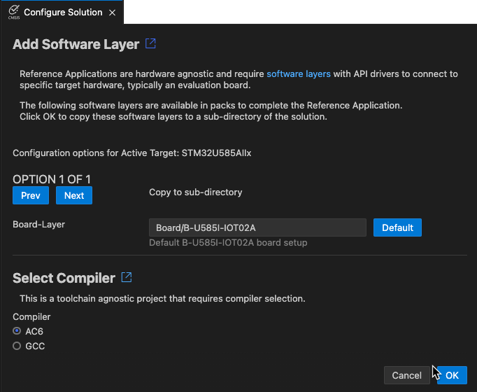

# Configuration

## Configure the extension

Press **Ctrl+,** (Windows and Linux) or **Cmd+,** (macOS) or go to  at the bottom of the **Activity Bar** and select **Settings**. Then, select **CMSIS Solution** to change the extension settings. The available settings are:

| Setting | Description |
|---------|-------------|
| Actions | Set run and debug configurations for your solutions and projects. |
| Download Packs | The CMSIS-Toolbox downloads required software packs using `cpackget` during setup and project build. This option enables the option `--packs` for `cbuild`. |
| Exclude | Configure a glob pattern for excluding files and folders in searches for csolution files. |
| Experimental Features | Use the checkbox to enable experimental features. |
| Generate Clang Setup | Use the checkbox to automatically generate the required setup (`.clangd` file and `.vscode/settings.json`) for the active solution context. For Arm Compiler 6, include pre-defined macros in the `.clangd` file. |
| Output Directory | Enter an output directory prefix for 'outdir' and 'tmpdir' and relocated build information files (experimental). |
| Use Web Services | Use the checkbox to enable web services to obtain information about devices, boards, and examples. If enabled, information from the internet and locally installed packs is used. If disabled, only information from installed packs is used. |

## Configure a solution

If you have not already set a compiler, select a compiler for your solution from the **Configure Solution** view. If you
created a reference application from a reference example, you can also add layers to your solution from the same view.

If your project has a `select-compiler:` node, but no `compiler:` node is set in the `csolution.yml` file, or if your
reference application has no layers defined, then the **Configure Solution** view opens automatically.

If you are working with a reference application, **Add Software Layer** displays, showing the software layers that you can
use. Layers are available from the CMSIS-Packs installed on your machine.

!!! Note
    - Not all Board Support Packs (BSPs) have board layers.
    - Not all layers are compatible with the connections that your reference application requires.
    - The CMSIS-Packs which contain reference applications and layers generally provide an `Overview.md` file where the connections are detailed.

If there are no compatible layers, errors display.

- Click **Next** to display the different options available.

- You can indicate where the layers should be copied to in the **Board-Layer**, **Shield-Layer**, and **Socket-Layer**
  fields. Click **Default** to reset the paths to their default values.

- If no compiler is set for the reference application, **Select Compiler** displays under the layers selection and shows the
  compilers available in your environment. Select a compiler. For example, AC6 or GCC.

- If you are working with another solution type, only **Select Compiler** displays. Select a compiler.

- Click **OK**.

For reference applications only, a `Board.clayer.yml` file, a `Shield.clayer.yml` file, or a `Socket.clayer.yml` file, along
with other files that make up the layer, are added in the folders that you selected. The files are available from the
**Explorer** view. The `.clayer.yml` files come from the CMSIS-Pack. Layers are automatically added in the `csolution.yml`
file of your solution under `target-types: variables:` for the active target.

For all solution types, the compiler is added with the `compiler:` key in the `csolution.yml` file.

## Configure a build task

In Visual Studio Code, you can automate certain tasks by configuring a `tasks.json` file. See
[Integrate with External Tools via Tasks](https://code.visualstudio.com/docs/editor/tasks) for more details.

With the CMSIS Solution extension, you can configure a build task using the `tasks.json` file to build your projects. When
you run the build task, the extension runs `cbuild` with the options that you defined.

!!! Note
    The examples on keil.arm.com include a `tasks.json` file that already contains some configuration settings to build
    your project. You can modify the default configuration if needed.

If you are working with an example that does not have a build task configured, follow these steps:

- Go to **Terminal** > **Configure Tasks...**.

- In the drop-down list that opens at the top of the window, select the **CMSIS Build** task. A `tasks.json` file opens with
  the default configuration.

- Modify the configuration.

With IntelliSense, you can see the full set of task properties and values available in the `tasks.json` file. You can bring
up suggestions using **Trigger Suggest** from the **Command Palette**. You can also display the task properties specific to
`cbuild` by typing ``cbuild --help`` in the **Terminal**.

- Save the `tasks.json` file.

Alternatively, you can define a default build task using **Terminal** > **Configure Default Build Task...**.
The **Terminal** > **Run Build Task...** option triggers the execution of default build tasks.
