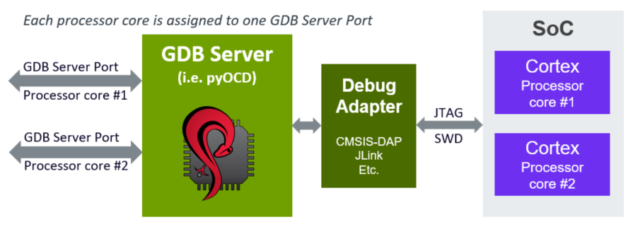
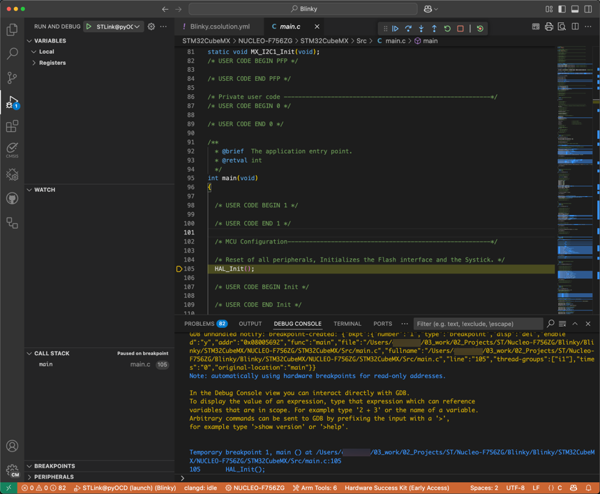

# Debug the application

Debugging is an essential task for every embedded developer. The [**CMSIS View**](#cmsis-view) offers action buttons to
start a debug session. The [**Run and Debug View**](#run-and-debug-view) lets you connect to the target.

Refer to the
[Arm CMSIS Debugger extension](https://marketplace.visualstudio.com/items?itemName=Arm.vscode-cmsis-debugger) for a
detailed description of debug features.

## CMSIS View

The CMSIS View offers these action buttons:

- **Load & Run** a *csolution* application which downloads and starts the application images in the target.
- **Load & Debug** a *csolution* application which downloads the application images and starts the debugger.
- **Manage Solution** configures the debug setup with the `target-set:` node. It also supports multiple configurations
  using a `set:` name.

The action button:

- **Load & Run** executes from `tasks.json` the command `CMSIS Load+Run`.
- **Load & Debug** executes from `launch.json` the first section with `"request": "launch"` and `cmsis:`. If this is
  not present it uses from `tasks.json` the command `CMSIS Load+Debug`.

Further commands are available under `...`:

- **Load** executes from `tasks.json` the command `CMSIS Load`.
- **Erase** executes from `tasks.json` the command `CMSIS Erase`.
- **Run** executes from `tasks.json` the command `CMSIS Run`.

## Run and Debug View

The **Run and Debug View** in VS Code connects to the target using the request selection shown below.

The **CMSIS Solution** extension handles multiple processor cores using one debug connection for each core.

## Debug on hardware

!!! Attention
    Make sure that your project is set up correctly for [run and debug](./configuration.md#configure-run-and-debug).

Make sure that your target is connected, before loading the application onto it. You can use `pyOCD` to verify target
connectivity.

1. Open a **Terminal**, and enter `pyOCD list` to check attached hardware:
   
2. In the **Solution** outline header, click . This executes the "load and debug"
   command that flashes the project onto the target and starts a debug session.

!!! Note
    If you are using a multicore device and you did not specify a `"processorName"` in the `launch.json` file, select the
    appropriate processor for your project in the **Select a processor** drop-down list at the top of the window.

The **Run and Debug** view displays and the debug session starts. The debugger stops at the `main()` function of the program:

The **Debug Console** tab displays the debugging output.
