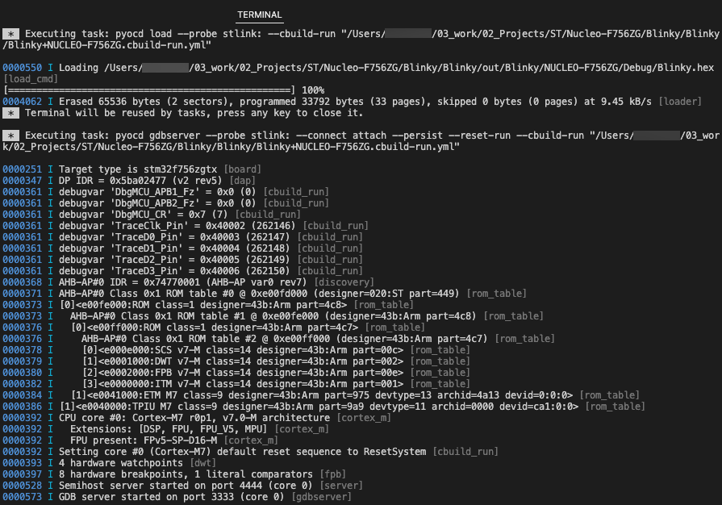

# Run the application

!!! Attention
    First, check that your hardware is connected to your computer.

Before you can start debugging the application, you need to download it to the flash of the target hardware.

!!! Notes
    - When you have several solutions in one folder, Visual Studio Code ignores the `tasks.json` and `launch.json` files that
    you created for each solution. Instead, Visual Studio Code generates new JSON files at the root of the workspace in a
    `.vscode` folder and ignores the other JSON files. As a workaround, open one solution first, then add other solutions to
    your workspace with the **File** > **Add Folder to Workspace** option.  
    - If you are using a multicore device and you did not specify a `"processorName"` in the `launch.json` file, select the
      appropriate processor for your project in the **Select a processor** drop-down list at the top of the window.

In the **Solution** outline header, click .

To verify that the project has run correctly, check the Terminal tab:

## Troubleshooting

If the Arm Debugger engine cannot be found on your machine, a dialog box appears:

Select one of these options:  

- To add Arm Debugger to your environment, click **Install Arm Debugger**. The `vcpkg-configuration.json` file is updated.
- To indicate the path to the Arm Debugger engine in the settings, click **Configure Path**.
