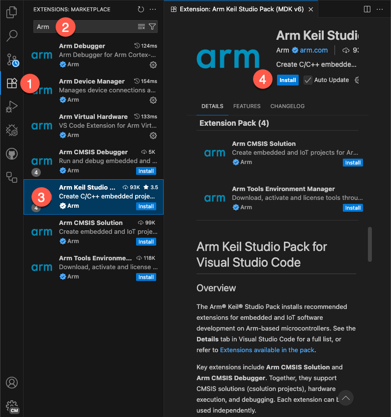
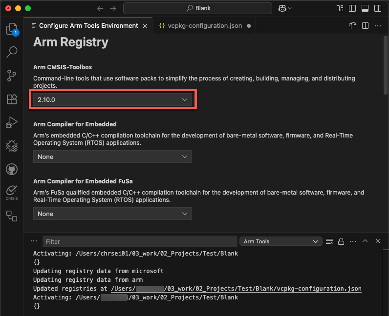

# Installation

<!-- markdownlint-disable MD036 -->

## Prerequisites

Arm Keil Studio is a set of extensions for [Microsoft Visual Studio Code](https://code.visualstudio.com/), which is
required to be installed on your machine.

## Installing Keil Studio

The [**Arm Keil Studio Pack (MDK v6)**](https://marketplace.visualstudio.com/items?itemName=Arm.keil-studio-pack)
extension pack includes the extensions that are required to work with CMSIS solution projects.

1. In VS Code, open the **Extensions** view.
2. Type `Arm` in the search bar.
3. Click on "Arm Keil Studio Pack" and README is shown on the right. It contains links to the included extensions. Their
   READMEs include minimal user guides.

4. Click **Install** to start. You need to trust the publishers "Arm" and "LLVM" to install the extension pack. When
   the installation is finished, the **CMSIS view icon**  appears in the
   activity bar.

### Verify the installation

Once you have installed Keil Studio, you can verify your installation by following the getting started guide that opens
automatically:


It's best practice to [create a new CMSIS solution](./create_app.md) based on a Blinky example, which typically flashes
an LED on a target board.

!!! Note
    When creating a solution based on an example, all required tools and packs are installed automatically.

## Set up a new workspace

If you want to install tools and packs separately, you have to create a new workspace in VS Code by opening a blank
folder.

### Tool installation

Required tools (such as a compiler toolchain or the CMSIS-Toolbox) are installed via the
**Arm Tools Environment Manager**, controlled by the `vcpkg-configuration.json` file.

Open the **Arm Tools Environment Manager** via the command pallette (Ctrl/CMd + Shift + p) and select
**Arm Tools: Configure Arm Tools Environment**. The "Arm Registry" opens:



Select at least an "Arm CMSIS-Toolbox" version as this is required to be able to [install packs](#pack-installation).
The **Output** pane shows the status of the "Arm Tools" installation.

!!! Attention
    - If you are using Keil Studio for the first time, the **Arm Tools Environment Manager** needs to download required
      tools from the Internet. While may take a couple of minutes (depending on your internet connection), it is only
      required once.
    - You also need to provide a license. A free, non-commercial
      [MDK-Community](https://www.keil.arm.com/mdk-community/) license can be activated from within the tool. If you
      need a commercial license, check our [eStore](https://store.arm.com/mdk-6/) or contact your preferred
      [distributor](https://www.arm.com/products/development-tools/distributors).

### Pack installation

CMSIS-Packs for device and board support as well as software delivery mechanism are an integral part of a CMSIS
solution. Packs can be discovered online:

- [List of CMSIS-Packs](https://www.keil.arm.com/packs)
- [List of devices](https://www.keil.arm.com/devices)
- [List of boards](https://www.keil.arm.com/boards)

Each page contains information about how to download a pack with
[cpackget](https://open-cmsis-pack.github.io/cmsis-toolbox/build-tools/#cpackget-invocation):


Run this command in a **Terminal** (you will be asked to accept the license agreement):

```sh
❯ cpackget add Keil::MDK-Middleware@8.0.0
I: Updating public index
I: Downloading index.pidx...
I: 100% |█████████████████████████████████████████████████████████| (216/216 kB, 405 kB/s)        
I: Updating PDSC files of public packs
I: Adding pack "Keil::MDK-Middleware@8.0.0"
I: Extracting files to /Users/chrsei01/.cache/arm/packs/Keil/MDK-Middleware/8.0.0...
I: 100% |█████████████████████████████████████████████████████████| (2180/2180, 2187 it/s)        
```

## Activating Keil Studio

Some of the Arm tools (for example
[Arm Compiler for Embedded](https://developer.arm.com/Tools%20and%20Software/Arm%20Compiler%20for%20Embedded) and
[Arm Debugger](https://developer.arm.com/Tools%20and%20Software/Arm%20Debugger)) require activation. You will be
flagged with a pop up window:


Click on "Manage Arm license" in the pop up. At the top, a new drop-down opens:


- If you want to evaluate Keil Studio or use it for non-commercial development, select "Activate Arm Keil MDK
  Community Edition".

- If you have a valid UBL server nor activation code, use "Activate or manage Arm licenses" to activate Keil Studio.

!!! Note
    - Open-source tools, such as
      [Arm GNU Toolchain](https://developer.arm.com/dev2/Tools%20and%20Software/GNU%20Toolchain) and
      [Arm CMSIS Debugger](https://marketplace.visualstudio.com/items?itemName=Arm.vscode-cmsis-debugger) do not
      require activation.
    - For more information visit the [user-based licensing](https://developer.arm.com/ubl) web page.
