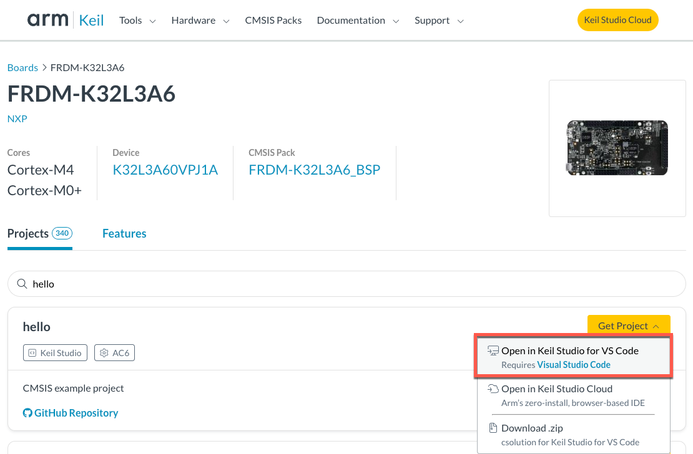
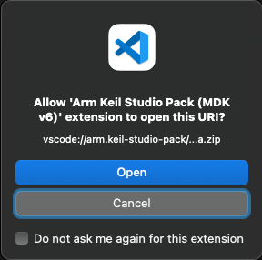

# Setup

<!-- markdownlint-disable MD036 -->

The **Arm Keil Studio Pack (MDK v6)** extension pack includes the CMSIS Solution extension and other extensions that you can use to work with CMSIS solution projects.

1. In Visual Studio Code, open the **Extensions** view and type `Keil Studio Pack` in the search bar.

2. Click **Install** to start the installation.
   When the installation is finished, the CMSIS view icon appears in the activity bar.

You can [create your first application](./create_app.md) or [download an example project](#find-an-example-project)
and then check that you can build, run, and debug the application.

!!!Note
    If you do not want to install all the extensions available in the pack, you can install the CMSIS Solution extension as standalone.
    Search for `CMSIS Solution` in the **Extensions** view.

## Find an example project

The [CMSIS boards list](https://www.keil.arm.com/boards/) contains many examples that you can use to verify that the extension works correctly. 

The following procedure explains how to start from an example for the [NXP FRDM-K32L3A6 development board](https://www.keil.arm.com/boards/nxp-frdm-k32l3a6-989d2e5/projects/). Adapt the steps to your development board.

1. In your browser, open the [CMSIS boards list](https://www.keil.arm.com/boards/).

2. In the search bar, type `frdm-k32`. Alternatively, you can search for a board using the **Vendor** and **Core** filters.

3. In the list of suggested boards, click `FRDM-K32L3A6`.
   The board page opens on the **Projects** tab. This tab shows the list of available example projects.

4. In the search bar, type `hello_frdm`.

5. In the **Get Project** drop-down list, select **Open in Keil Studio for VS Code** to download the example to your computer and open it in Visual Studio Code.
   

   Visual Studio Code asks for a permission to open the URI.
   

6. Click **Open**.

7. Select a download location.

8. Select **Open in New Window** to open the example in a separate Visual Studio Code window.
   

9. If you installed the Keil Studio Pack, confirm that the Arm Tools Environment Manager extension can automatically activate the workspace and download the tools specified in the `vcpkg-configuration.json` file included in your project.
   

You can now [build](./build.md) and [debug](./debug.md) the example project.
