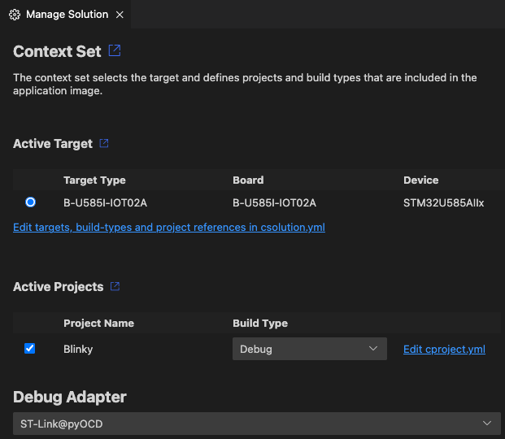

# Manage Solution Settings

In the **Manage Solution** view, you can select the target, projects, and build types that are included in the application image. This is called **Context Set**.

In the **CMSIS view's Solution outline**, click **Manage Solution Settings**
. The **Manage Solutions** view opens:

You can change the [active target](#active-target) type, and the [active projects](#active-projects) included in the
build, as well as the build type of a project.

## Active Target

Select a **Target Type** to specify the hardware used to build the solution. Some examples are also compatible with Arm
Virtual Hardware (AVH) targets, in which case more options are available. For more details, read the [AVH solutions overview](https://arm-software.github.io/AVH/main/overview/html/index.html).

To specify your target types by editing the YAML file directly, click **Edit targets, build-types and project references in csolution.yml**.

## Active Projects

This section shows the projects that are part of the solution. Use the checkboxes to add or remove projects from the context set. The **Project Name** displays and cannot be changed.

Select a **Build Type** for each project. You can set different build types for different projects in your solution.

Click **Edit cproject.yml** next to a project to open the `<project-name>.cproject.yml` file. YAML syntax support helps you
with editing.

!!! Note
    The projects and build types that you can select are defined by contexts for a particular target. Some options might be
    unavailable if they have been excluded for the target selected. To learn more about contexts and how to modify them, see the [Context](https://github.com/Open-CMSIS-Pack/cmsis-toolbox/blob/main/docs/YML-Input-Format.md#context) and
    [Conditional build](https://github.com/Open-CMSIS-Pack/cmsis-toolbox/blob/main/docs/YML-Input-Format.md#conditional-build) information in the CMSIS-Toolbox documentation. For example, you can use `for-context` and `not-for-context` to include or exclude target types at the `project:` level in the `*.csolution.yml` file.

## Errors and warnings

You can inspect errors and warnings for a context set. For active projects in the context set, errors and warnings
display when you move your cursor over the **Context Set** in the status bar. The indicator is red for errors and yellow
in case of warnings.

Click the indicator to open the **Output** tab for the **CMSIS Solution** category. If you previously closed the
**Manage Solution** view, then this action also re-opens the view.

You can also go to the **Problems** tab and check for errors.

Open the `main.c` file and check the IntelliSense features available. To find out about the different features, read the VS Code documentation on [IntelliSense](https://code.visualstudio.com/docs/editor/intellisense).
